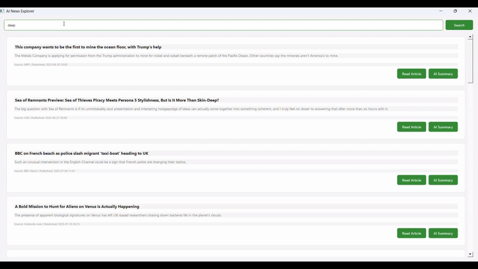

# AI News Explorer 📰✨


*A desktop application for focused, intelligent news consumption, powered by local AI.*

---

## The Problem: Drowning in News

In an age of information overload, staying informed feels like trying to drink from a firehose. Traditional news sites are filled with ads, auto-playing videos, and endless clickbait. Finding the signal in the noise is a daily challenge.

## The Solution: AI News Explorer

**AI News Explorer** is a desktop application designed to cut through the clutter. It provides a clean, focused interface to find exactly the news you're interested in and uses the power of local AI to give you detailed summaries on demand. It's not just another news aggregator; it's an intelligent tool for comprehension.

### **How is This Different?**

| Feature | Typical News Aggregators | **AI News Explorer** |
| :--- | :--- | :--- |
| **Summaries** | Short, often extractive (just copies sentences). | **Detailed, Abstractive AI Summaries**. The AI understands the article and writes a human-like summary. |
| **Privacy** | Your reading habits and content are processed on cloud servers. | **100% Local AI & Private**. All summarization happens on your machine. Your data never leaves your computer. |
| **Experience** | Web-based, cluttered with ads, pop-ups, and distractions. | **Clean, Focused Desktop App**. No ads, no distractions. Just the news content you want. |
| **Control** | Fixed summary lengths. | **Deep Dives on Demand**. Summaries are configured for length, providing a substantial digest of the article. |

---

## Key Features

- 🎯 **Keyword-Based Search:** Instantly find news articles on any topic you want.
- 🤖 **Local AI Summarization:** Get detailed, AI-generated summaries with the click of a button. Powered by `facebook/bart-large-cnn`.
- 🔒 **Privacy First:** All sensitive processing is done locally. Your reading data is yours alone.
- 🖥️ **Clean Desktop GUI:** A user-friendly interface built with PyQt5 provides a focused, ad-free reading experience.
-  कार्ड **Article Card Display:** News is presented in a clear, organized format for easy scanning.
- 🌐 **Direct Article Access:** Seamlessly open the original article in your web browser for a full read.

---

## Technology Stack

- **Core Application:** Python 3
- **GUI Framework:** PyQt5
- **AI & NLP:** Hugging Face `transformers` with PyTorch
- **News Source:** [NewsAPI.org](https://newsapi.org/)
- **API Interaction:** `requests`
- **Environment Management:** `python-dotenv`

---

## Setup and Installation

### Prerequisites

- Python 3.8+
- An API key from [NewsAPI.org](https://newsapi.org/)

### Installation Guide

1.  **Clone the Repository:**
    ```bash
    git clone https://github.com/your-username/ai-news-explorer.git
    cd ai-news-explorer
    ```

2.  **Set Up a Virtual Environment (Recommended):**
    ```bash
    # For Windows
    python -m venv venv
    .\venv\Scripts\activate

    # For macOS/Linux
    python3 -m venv venv
    source venv/bin/activate
    ```

3.  **Install Dependencies:**
    ```bash
    pip install -r requirements.txt
    ```
    *Note: This includes PyTorch and can be a large download.*

4.  **Configure Your API Key:**
    -   Copy the example environment file: `cp .env.example .env` (on macOS/Linux) or `copy .env.example .env` (on Windows).
    -   Open the newly created `.env` file and replace `YOUR_API_KEY_GOES_HERE` with your actual key from NewsAPI.
    -   This file is intentionally ignored by Git to keep your key secure.

---

## How to Run

1.  **Launch the Application:**
    ```bash
    python main_script_name.py 
    ```
    *(Replace `main_script_name.py` with the actual name of your Python file)*

2.  **First-Time AI Model Download:**
    The first time you run the app, it will download the AI model (`bart-large-cnn`, several gigabytes). This is a one-time process. On subsequent launches, it will load the model from your local cache, which is still a resource-intensive step that may temporarily freeze the UI.

---

## License

This project is licensed under the MIT License. See the `LICENSE` file for more details.
